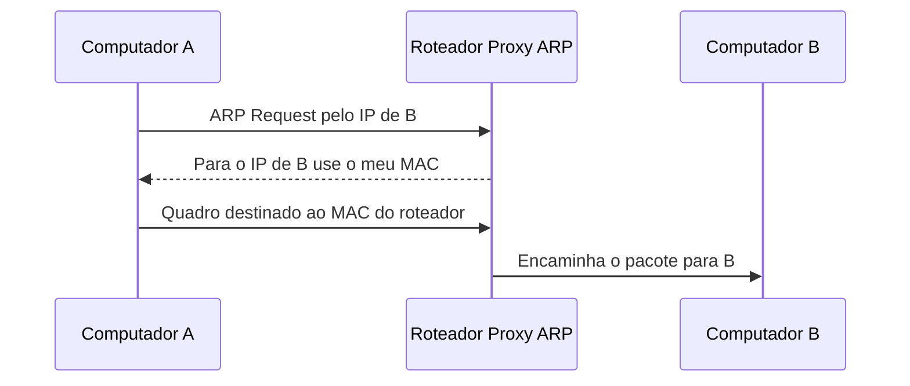
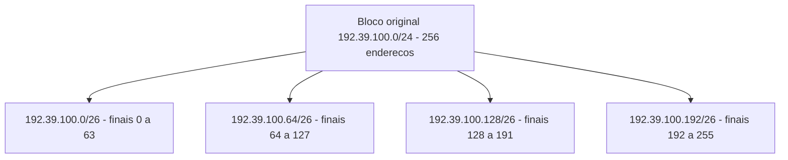

# Aula 7 — Manipulação de Endereços IP (Parte 1)

## 1. Problema inicial

- Uma organização pode possuir várias redes físicas.
- Solicitar um bloco de IPs para cada rede causa desperdício.
- Vários blocos também aumentam as tabelas de roteamento da Internet.
- O objetivo é usar um único bloco de endereços em várias redes internas.
- A aula apresenta duas soluções: **Proxy ARP** e **sub-redes**.

## 2. Proxy ARP

- **Proxy:** entidade que atua como intermediária.
- No Proxy ARP, o roteador responde a uma consulta ARP em nome de outro dispositivo.
- O computador considera o destino local e pergunta pelo MAC dele.
- Como o broadcast ARP não atravessa roteadores, o destino não recebe a pergunta.
- O roteador responde usando seu próprio MAC.
- O computador envia o quadro ao roteador.
- O pacote IP continua destinado ao computador original.
- O roteador encaminha o pacote para a outra rede física.
- Para os computadores, as redes físicas parecem uma única rede IP.
- Exige controle dos endereços para evitar IPs duplicados.
- Não é uma solução muito escalável.

## 3. Sub-redes

- Dividem um bloco de endereços em redes IP menores.
- Cada sub-rede pode representar um departamento ou uma rede física.
- Roteadores fazem o encaminhamento entre as sub-redes.
- A divisão interna pode ser transparente para o restante da Internet.
- Permitem melhor organização, filtragem e administração.
- Para criar sub-redes, alguns bits de host passam a identificar redes.

## 4. Máscara de sub-rede

- A máscara possui 32 bits, assim como o IPv4.
- Bit `1`: identifica a parte da rede.
- Bit `0`: identifica a parte do host.
- `/24` equivale a `255.255.255.0`.
- `/26` equivale a `255.255.255.192`.
- Passar de `/24` para `/26` usa dois bits adicionais para a rede.
- Dois bits permitem criar 2² = 4 sub-redes.
- Sobram seis bits para hosts em cada sub-rede.
- Cada `/26` possui 2⁶ = 64 endereços.
- Nos exemplos tradicionais, 62 são utilizáveis: um identifica a rede e outro é o broadcast.

## 5. Exemplo da aula

- Bloco original: `192.39.100.0/24`.
- Divisão: quatro sub-redes `/26`.

| Sub-rede | Hosts utilizáveis | Broadcast |
|---|---|---|
| `192.39.100.0/26` | `.1` a `.62` | `.63` |
| `192.39.100.64/26` | `.65` a `.126` | `.127` |
| `192.39.100.128/26` | `.129` a `.190` | `.191` |
| `192.39.100.192/26` | `.193` a `.254` | `.255` |

Para o IP `192.39.100.86/26`:

- O número 86 está no intervalo de 64 a 127.
- Sub-rede: `192.39.100.64/26`.
- Broadcast: `192.39.100.127`.
- Host-ID: 86 − 64 = 22.
- Portanto, é o **host 22 da sub-rede `192.39.100.64`**.

## 6. Cálculos principais

Quantidade de sub-redes:

```
2 ^ (bits adicionados à rede)
```

Quantidade total de endereços por sub-rede:

```
2 ^ (bits restantes para host)
```

Quantidade tradicional de endereços utilizáveis:

```
2 ^ (bits de host) - 2
```

O endereço da sub-rede pode ser calculado com:

```text
Endereço IP AND máscara = endereço da sub-rede
```

## Diagrama — Proxy ARP



- A considera que B está na mesma rede IP.
- O ARP Request de A não chega até B, pois ele está em outra rede física.
- O roteador responde em nome de B, informando seu próprio MAC.
- A envia o quadro ao roteador, mas o pacote IP continua destinado a B.
- O roteador monta um novo quadro e encaminha o pacote para B.

## Diagrama — Divisão em sub-redes



- O bloco `/24` possui 256 endereços.
- Dois bits de host foram usados para identificar sub-redes.
- Dois bits permitem criar 2² = 4 sub-redes.
- Cada `/26` possui 64 endereços.
- Nos exemplos tradicionais, cada `/26` possui 62 endereços utilizáveis.
- O IP `192.39.100.86/26` pertence à sub-rede `192.39.100.64/26`.