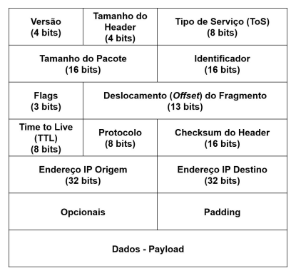

# AULA 9 — O Protocolo IP (pt. 1)

## Arquitetura da Internet

- A infraestrutura da Internet é uma **rede IP**: roteadores ligados por enlaces de tecnologias variadas
- Serviço **best effort** (melhor esforço): não-confiável e não orientado à conexão
- Consequências: pacotes podem se **perder**, chegar **fora de ordem** ou **duplicados**
- Não existem circuitos virtuais — cada roteador trata cada pacote de forma independente e não guarda estado
- A confiabilidade fica **nas pontas**: TCP ou a aplicação
- IP = RFC 791; cuida de endereçamento, roteamento e encaminhamento; unidade de dados = **datagrama**

## Versão (4 bits)

- Indica qual protocolo: **4** = IPv4, **6** = IPv6
- É o primeiro campo de propósito, permitindo coexistência IPv4/IPv6 — o roteador lê a versão e só então sabe interpretar o resto
- É o único campo idêntico nas duas versões

## Tamanho do header — IHL (4 bits)

- Existe porque o cabeçalho tem tamanho **variável** (por causa dos opcionais)
- Conta **palavras de 32 bits** (4 bytes), não bytes
- Sem opcionais: 20 bytes → **IHL = 5**; máximo: IHL = 15 → **60 bytes**
- Cabeçalho = parte fixa (20 B) + opcionais (0 a 40 B) + padding
- Roteadores comerciais atuais descartam pacotes com opcionais

## Tipo de Serviço (ToS) e a saga do QoS

- Projeto original: 3 bits de **precedência** (8 classes) + flags **DTR**
  - **D**elay: 0 = normal, 1 = baixo
  - **T**hroughput: 0 = normal, 1 = alto
  - **R**eliability: 0 = normal, 1 = alta
- Falhou porque todo mundo pediria prioridade máxima → roteadores passaram a ignorar
- Anos 90: capacidade cresceu ordens de magnitude + tráfego virou multimídia (VoIP, streaming)
  - Exemplo clássico: em VoIP, pacote com mais de **50 ms** de atraso é melhor descartar
- Duas propostas do IETF:
  - **IntServ** — garantias fortes de entrega. Não vingou
  - **DiffServ** — reinterpretou o ToS em **DSCP** (6 bits, 64 níveis) + **ECN** (2 bits)
- Diferença ToS × DSCP: no ToS o roteador aceitava a marcação da aplicação; no **DSCP o roteador aplica política** e pode aceitar, recusar ou alterar a prioridade
- **ECN**: sinaliza congestionamento no header para a origem reduzir a taxa, em vez de descartar
- **Desfecho real: overprovisioning** — provedores instalam capacidade acima da demanda; usuário aceita pequenos atrasos em troca de tarifa mais livre
  - Desvantagem: desperdício de recursos; tendência é a nuvem com escalabilidade automática resolver
- DSCP sobrevive em **ambientes controlados** (universidades, datacenters, empresas) — ex.: priorizar sincronização de BD sobre backup

## Tamanho do pacote e MTU

- Campo de 16 bits → datagrama de até **64 KB**
- **MTU** = máximo de dados que cabe num quadro do enlace; Ethernet = **1500 bytes**
- Pacote > MTU → fragmentação

## Fragmentação — os três campos

| Campo | Bits | Função |
|---|---|---|
| Identificador | 16 | Mesmo valor em todos os fragmentos do mesmo datagrama |
| Flags | 3 | bit 0 reservado; **DF** = não fragmentar; **MF** = ainda vêm mais fragmentos |
| Offset | 13 | Distância até o início do payload **original**, em palavras de **8 bytes** |

- Cada fragmento é um **pacote IP completo** (ganha seu próprio header de 20 B)
- MF = 1 em todos, exceto no último
- Como o offset conta de 8 em 8, o payload de todos os fragmentos (menos o último) tem que ser **múltiplo de 8**

## Roteiro de cálculo

1. Payload útil por fragmento = MTU − 20 → **arredondar para baixo até múltiplo de 8**
2. Payload original = tamanho total − 20
3. Nº de fragmentos = payload original ÷ payload por fragmento (arredondando **para cima**)
4. Offsets acumulam de payload em payload, sempre a partir de zero
5. Conferir: soma dos payloads + 20 = tamanho original

## Exemplo canônico: 3400 bytes, MTU 1500

| Fragmento | Total | Payload | Offset | MF |
|---|---|---|---|---|
| 1 | 1500 | 1480 | 0 | 1 |
| 2 | 1500 | 1480 | 1480 | 1 |
| 3 | 440 | 420 | 2960 | 0 |

- O valor gravado no campo é o offset **÷ 8** → 0, 185, 370
